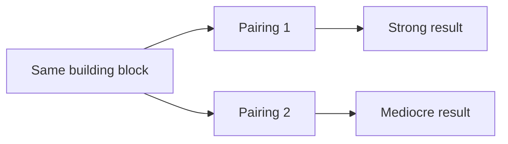

The first paid computer vision work I ever did was a one month freelance project: detect road damage from images. Nobody was reviewing my architecture choices. Whatever I picked, I had to be able to defend it to myself, which is a different bar than defending it to a reviewer.

## The comparison you run when you can afford one

For the first part of that project I had the time and the freedom to compare a real spread of architectures against the same dataset, scored the same way. That is the version of model selection people mean when they talk about it in a course: you have room to search, so you search, and you pick the winner.

What stuck with me was not the winner. It was noticing how differently the same building block behaved depending on what it was paired with. A choice that looked strong in one combination was mediocre in another, on the exact same images. Comparing pieces one at a time, instead of as the whole thing they become together, would have quietly pointed me at the wrong answer.

*Same piece, different pairing, a different answer. That was the actual lesson, not which model won.*

## The choice you make when you cannot

A few months later I led a small team building a real time traffic monitoring system, and there was no room for that kind of search. The video had to process close to live, on hardware that was not going to improve, from footage that was never going to get clearer. I made one confident choice and spent the rest of my time on the harder problem sitting next to it, turning raw detections into a rule that did not fire on nothing.

## What the two had in common

Neither project was more rigorous than the other. One was a lesson in comparing things as pairs, not as interchangeable parts. The other was a lesson in what happens when comparison is not available at all, and the real skill becomes knowing which constraint is serious enough to stop searching and commit. A month of freelance work is a strange place to learn both halves of that at once, but that is what it was.
