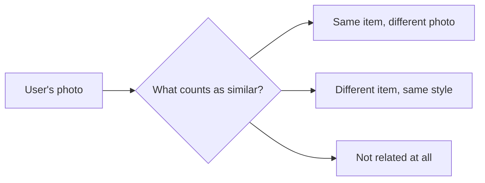

Before the infrastructure work at Yuna & Co. took over my time, the first thing I owned there was the machine learning side of a styling platform: recommendations, image understanding, product search. A styling app cannot lean on a text search box the way a normal store can, because a lot of what a user brings is a photo of an outfit, not a sentence describing one.

## A photo is a question with no words in it

That reframes the whole problem. "Find me this" stops being a text matching exercise and becomes a question of what counts as similar: similar color, similar silhouette, similar enough to be the same item photographed twice. Every feature I built, from a wardrobe search to an admin tool for assembling outfit references, was really the same underlying question answered for a different audience.

*One question, answered slightly differently depending on who was asking it and why.*

## One answer, reused everywhere

The tempting mistake would have been building a separate, bespoke solution for each feature that touched this question. Instead, one shared way of judging similarity fed all of them: the wardrobe search, the style card generator, the recommendation surface a shopper saw on a product page. It started as a constraint, a small team with more to build than people to build it for. What came out of the constraint was not a compromise. It turned out to be the right shape for the problem regardless of team size.

## Why this stuck with me

The interesting part was never any single model. It was realizing that "similar" is not one fixed idea, it changes meaning depending on what question is actually being asked, and the discipline is in noticing that early rather than discovering it later as a pile of inconsistent features that all claim to solve the same thing.
