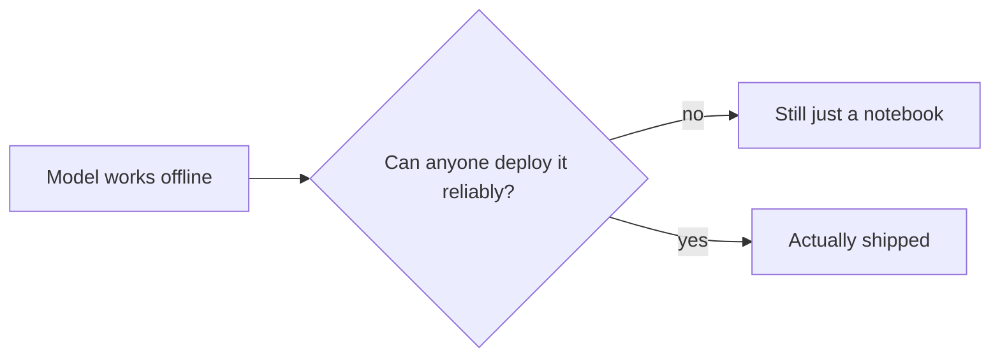

I was hired at Yuna & Co. to build recommendation and image understanding services. Nobody hired me to do DevOps. But at some point someone has to own how things get deployed, and at a small team that someone is usually whoever notices the problem first and cannot stop thinking about it.

## Shipped is a claim about more than code

What I noticed was that every deploy was a slightly different manual ritual, and every service behaved a little differently from the last one depending on who had touched it last. A model that scores well offline is not actually shipped if nobody can deploy it reliably. It is just sitting in a notebook, however good the numbers look, and that gap between "it works on my machine" and "it works reliably for everyone" turned out to be most of the real engineering effort on a small team.

*The gap between those two boxes was where most of my time actually went, not in the modeling.*

## Consistency was the whole project

Fixing that meant treating every service the same way regardless of who wrote it or what it did: the same deployment shape, the same way of recovering from failure, the same way traffic found it. None of that is exciting to describe and all of it is the difference between a feature that works in a demo and one that keeps working after everyone stops paying attention to it.

## What actually changed for me

I joined thinking my job was the model. I left understanding that the engineering discipline around a service, whether it deploys predictably and recovers on its own, mattered as much as anything I trained. That is not a lesson about tools. It is a lesson about where the real risk in a system actually lives, and it is rarely where the interesting math is.
