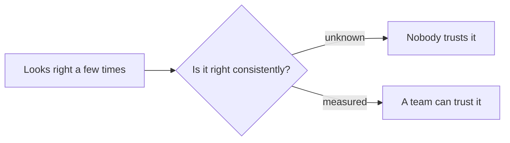

By the time Mas Ahya was answering questions correctly in a demo, that was not the same as anyone on the team being comfortable letting it answer a real farmer's question unsupervised. A wrong answer about a shrimp pond is not a cosmetic bug, it can cost someone a harvest. Getting from "it works when I try it" to "we trust it enough to ship" turned out to be its own project, separate from building the assistant in the first place.

## A demo is not evidence of anything

A handful of tests looking good tells you almost nothing about how something behaves across thousands of real questions, with real phrasing and real edge cases nobody thought to try. That gap between looking right a few times and being right consistently is where most of the anxiety about shipping an LLM feature actually lives, and it does not close by writing a better prompt.

*Closing that gap, not the prompt itself, was the actual project.*

## Trust as something you can point to

What changed things was moving quality from a feeling into a number everyone had already agreed to trust. Once "is this good enough to ship" stopped being an argument between whoever was loudest in the room and became a threshold the team had settled on ahead of time, decisions got faster, not slower, because nobody had to re-litigate the same worry every release.

## Why this mattered more than any single feature

I have come to think that the habit of measuring trust, rather than assuming it, is the actual precondition for moving fast on anything else. Every later change I made to that system, including changes meant purely to save money, only felt safe to ship because the team already had a way to know whether it had broken something. The measurement came first. Everything else was downstream of it.
