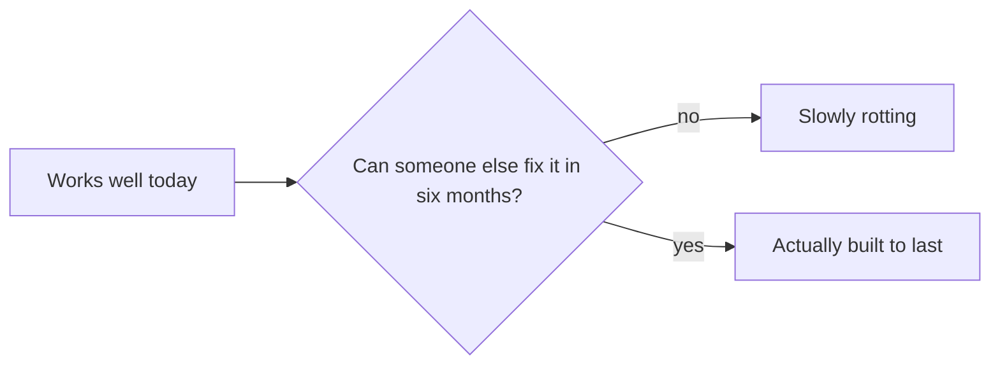

Great Giant Foods is one of Indonesia's largest agribusinesses, and its banana harvest records lived on paper forms filled out in the field. My job, over a three month freelance engagement, was to get that paperwork into a system without anyone re-typing it by hand. The technology got the accuracy question solved quickly. The actual constraint was that I would be gone in three months and someone who does not write code would still need to adjust how the system read a form when the paperwork itself changed, which it eventually would.

## Accuracy was never the hard problem

If reading a form correctly on day one were the whole job, the engagement would have been short. But agribusiness paperwork is not static. Forms get revised, a field gets renamed, someone adds a column for a new variety. If every change like that needed an engineer to come back and touch something, the system would start rotting the week I left, quietly, in a way nobody would notice until it mattered.

*Day one accuracy was never the real test. Six months later was.*

## Writing for a reader, not just a model

So I treated the instructions themselves as something meant to be handed off, not hidden inside code only I could safely touch. The parts most likely to change needed to be readable by someone with no context, not just effective when I ran them myself. That is a real constraint, the same way speed or cost is a real constraint, even though almost nobody talks about it that way.

## What actually mattered here

Most advice about getting good results from a model is about getting a good answer once. For anything meant to outlast the day it ships, that instruction has to do two jobs at the same time: get the model to behave, and read as documentation for whoever inherits it. This was the first engagement where I treated those as equally important, instead of one being the real requirement and the other a nice to have.
