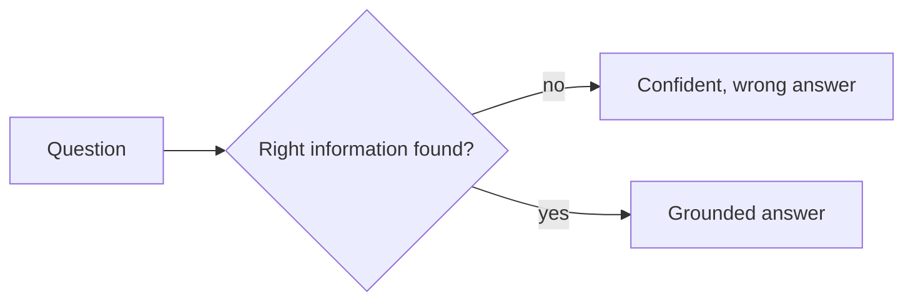

The OCR work at Great Giant Foods got the harvest paperwork problem solved, but there was a second, quieter problem sitting right next to it. The internal documentation on banana cultivation lived in a pile of PDFs that nobody enjoyed searching. Good information that takes ten minutes to find might as well not exist when someone is standing in a field with a question that cannot wait ten minutes.

## The model is rarely why this fails

The unglamorous truth about building something like this is that the language model answering the question is almost never the reason it goes wrong. It goes wrong earlier, when the system reaches for the wrong piece of information in the first place and answers confidently anyway. Most of the real work is upstream of the part anyone thinks of as "the AI."

*The failure almost always happens at the first box, not the last one.*

## An answer has to point somewhere

An answer that sounds right but cannot be traced back to something real is worse than no answer, because it looks trustworthy right up until it costs someone a bad decision on the plantation. Every answer needed a real basis in the documents the team already had, not the model's general sense of what bananas are usually like, which is often close enough to be dangerous exactly when it is wrong.

## What the goal actually was

This engagement was three months, and the honest goal was never to build something comprehensive. It was to build something the cultivation team could keep asking questions of after I left, using documents they already owned, without needing anyone to maintain a search index by hand. Comprehensive was never the bar. Still working in six months was.
