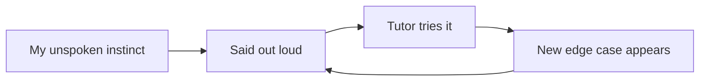

The first thing I did in my first engagement with HDCE Inc. was not building anything. It was mentoring their team on local LLM training and fine-tuning, so they could apply it to their own real work. I have fine-tuned models plenty of times for myself. Teaching someone else to do it, and having it stick after I was no longer in the room, turned out to be a genuinely different skill from doing it.

## Instinct does not transfer on its own

When I fine-tune a model for my own project, I make a dozen small judgment calls without noticing I am making them. None of that is written down anywhere in my head, it is just accumulated instinct built from getting it wrong enough times privately. Mentoring meant surfacing those calls out loud, because someone else cannot copy instinct they never saw articulated in the first place.

*The loop only closed once someone else's edge case forced another piece of instinct into the open.*

## The questions I could not answer were the useful ones

The most valuable sessions were never the ones where I demonstrated something cleanly. They were the ones where someone's dataset broke in a way mine never had, and I had to reason through it live instead of reciting something I already knew. Being wrong in front of someone I was supposed to be teaching was uncomfortable. It was also where most of the actual learning happened, on both sides.

## What being on the other side of it taught me

Mentoring did not make me better at fine-tuning a model myself. It made visible, for the first time, the gap between a decision I could execute and one I could explain to someone with less context, and that gap turned out to be exactly where the next hard question would come from.
