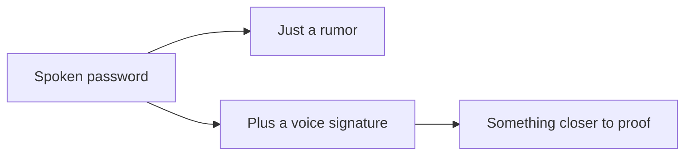

Between the mentoring work and other work for HDCE Inc., I was also handed a proof of concept that turned out to be more interesting than it first sounded: build a voice based authentication system that works over a regular phone call. No app, no fingerprint sensor, just a voice on the line, and a decision at the other end about whether to trust it.

## One signal is a rumor, not a proof

The obvious version of this is a password spoken aloud, and that alone is not authentication, it is just a rumor about who might be calling. Anyone who overhears the phrase can repeat it. Real verification had to come from the voice itself as a biometric signal layered on top of what was being said, not a substitute for asking the right question at all.

*One signal alone was never going to be enough, no matter how clever the phrase.*

## Real conditions are unkind to clean assumptions

Phone audio is compressed, noisy, and inconsistent in ways a clean recording never is, and a check that works beautifully in a quiet room can fail quietly on a real call. The genuinely hard part was not building each piece, it was accepting that the two failure modes that matter, wrongly rejecting a real caller and wrongly trusting an impostor, both have to stay rare using audio that was never designed for this.

## What this left me with

This was a short proof of concept, not a shipped product, and it left me with a general suspicion of any system that claims one signal is enough. Security is a stack of weaker signals combined until the combination is strong, and treating a single check as sufficient, whether it is a voice or a password or anything else, is usually where the design starts lying to itself.
