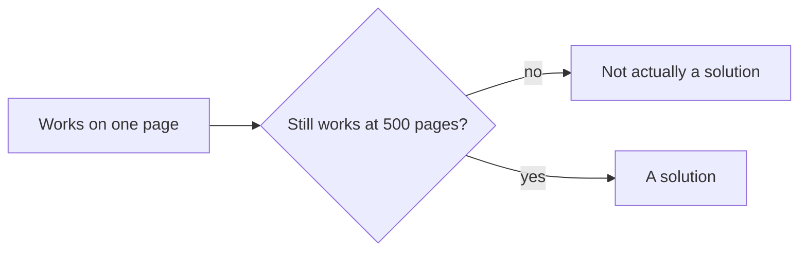

Most of what I write about eFishery is Mas Ahya, since it is the project that reached the furthest. But as AI Squad Leader I also supervised work that never got a stage demo and taught me just as much, including automating sensitive data masking across bank statements, some running to 500 pages, that used to be reviewed by hand.

## A solution that only works small is not a solution

Something that redacts one page correctly can still fail completely at document five hundred, if nobody thought about what happens when the input gets big instead of just being right. A person reviewing a long document by hand is exactly the failure mode you would predict: tired, inconsistent, most likely to miss the one thing that mattered on page three hundred and forty of five hundred.

*Correct on a small example and correct at real scale are two different claims, and only one of them matters in production.*

## Automating the risky part, not just the slow part

The instinct is to think automation here was about speed. It was really about removing the specific failure mode that manual review was most prone to: a tired reviewer missing something on a page nobody was paying close attention to anymore by the time they reached it. Speed was a side effect. Consistency was the actual point.

## The shape of the lesson

The interesting engineering here was never any single model, it was making sure that document size stopped being the thing that determined how long someone waited or how likely something was to be missed. A five page sample and a five hundred page statement should not feel like different systems to the person on either end of them.
