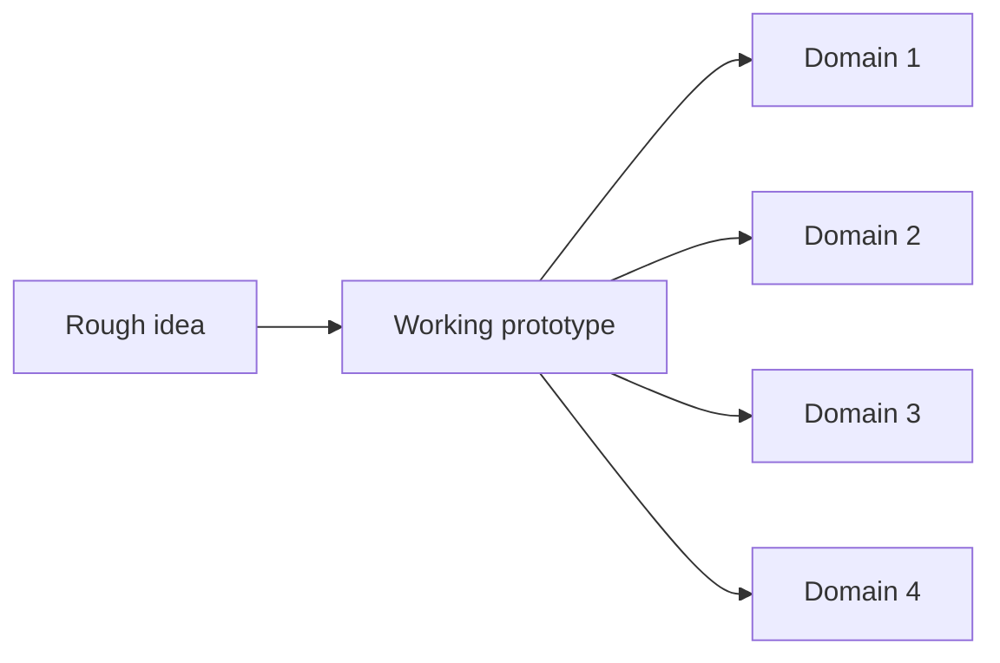

My second engagement with HDCE Inc. was with TIB Finance, its fintech subsidiary, and it did not look like a normal role with a fixed scope. Ideas reached me as sentences rather than specs, which in practice meant taking a rough idea and turning it into a working prototype fast, across domains, real time speech, LLM agents, marketing content, financial automation, that shared almost nothing except a deadline.

## Depth was not the skill being tested

None of these four things shared a codebase, a failure mode, or even a vocabulary, and I was often moving between them in the same week. The obvious assumption is that this only works if you already have deep expertise in all four, which I did not. What made it workable was something else entirely: the ability to take a vague idea and turn it into something real, fast, independent of which domain it happened to land in.

*Same muscle, four different places to point it. The domain was the least interesting variable.*

## Context switching has a real cost, and a real limit to it

Jumping between unrelated systems in the same week is not free. Something is always half warm in your head from the last thing, and the discipline was less about the technical content of any one system and more about how quickly I could set the previous context down and pick up a new one without carrying stale assumptions across.

## What this engagement actually trained

That is a different muscle than depth in any single domain, and it is the one this engagement trained the hardest. I came out of it with more respect for "generalist" as an actual skill, not a euphemism for not being deep enough at anything.
