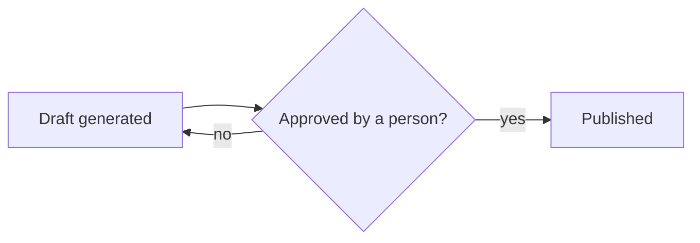

One of the tracks I built during the TIB Finance engagement was a marketing automation system, generating and scheduling content with very little manual effort. It would have been technically straightforward to automate the last step too, publishing without anyone looking at it first. I did not do that, on purpose, and the reasoning behind that choice ended up more interesting than the automation itself.

## Full automation was available, and I turned it down

The system could have posted the moment a draft passed whatever automated check I wrote. I built a human approval step in instead, so a real person saw every post before it went out. That is a slower system than the fully automated version, and it is the right tradeoff for anything representing a company in public, where a wrong call cannot be quietly undone.

*The loop only exits through a person, every time, no exceptions.*

## A workflow and a decision are not the same problem

It is tempting to describe the approval step as a limitation to remove once the system proves itself. I do not see it that way. The generation part was a workflow, and workflows are exactly what automation is good at. The publish decision was a judgment call about brand and timing, and no amount of the workflow getting better changes who that judgment actually belongs to.

## Where the real gain was

Conflating those two problems is how a useful tool quietly turns into a liability. The generation could move fast, research and drafting compressed from hours to minutes. The decision to publish stayed exactly as slow as it needed to be, which was the entire point of building it this way rather than the fastest possible way.
