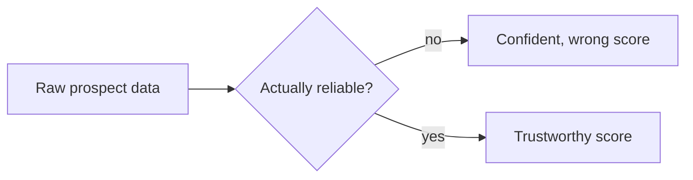

Multi-client scoring only became a problem worth thinking hard about once the pipeline had leads that were clean enough to score in the first place. Before that, at the start of building Leadflow at Berning, the actual bottleneck sat earlier in the pipeline: getting raw prospect data into something structured enough for any scoring logic, whoever's criteria it was applying, to trust.

## Confident and wrong looks identical to confident and right

Raw data does not announce that it is unreliable. A record can look complete and still be quietly wrong in ways that are easy to miss: a mismatched detail, a technically accurate field that means something different than it appears to. None of that is exotic. It is the ordinary state of anything pulled from a raw source, and a system fed that directly will produce confident output either way, because nothing about scoring alone tells it the input was bad.

*Both branches produce a score that looks the same on the screen. Only one of them means anything.*

## Trust is earned before judgment is applied

Whatever a client's specific criteria were, they all shared one hidden assumption: that the facts about a prospect being judged were actually correct. Get that assumption wrong and no amount of thoughtful scoring logic downstream fixes it, it just applies more careful weights to the same bad input, which is worse than doing nothing, because it looks considered.

## Why the boring part came first

If I had started with scoring and treated everything before it as an afterthought, every demo would have looked fine on the examples I happened to pick, and quietly failed on the messy reality every real dataset actually is. Building the unglamorous part first is what let me trust the interesting part once it existed.
