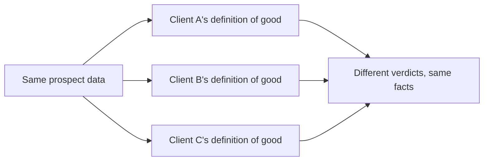

At Berning I am building Leadflow, an AI powered lead generation platform, end to end. The problem that has taken up the most of my attention is not any single step in that pipeline, it is that the judgment at the end of it has to serve many clients at once, and a good lead for one client can look nothing like a good lead for another.

## Averaging away the thing that makes it useful

The easy version of this is one scoring approach, tuned on general signals, applied the same way to every client. It would work adequately for everyone and well for no one, because "adequately for everyone" is what you get when you average away the exact preferences that make a client's definition of quality theirs in the first place.

*Same underlying facts, genuinely different verdicts. That was the whole design problem in one picture.*

## Judgment does not generalize the way data does

The parts of the system that could stay shared, gathering and structuring information about a prospect, did. The part that could not was the judgment itself: what actually counts as qualified. Trying to force that into one generic definition was not simplicity, it was just picking whose definition of a good lead wins by default, and defaulting to nobody's definition on purpose turned out to be worse than picking badly on purpose.

## What the system actually had to respect

The lesson generalizes past lead scoring. Any system serving more than one customer with genuinely different standards has to decide, explicitly, which parts of "good" are actually shared and which parts only look shared until you ask two different people to define it. Keeping the underlying facts common and the judgment specific is what let the same pipeline mean something different, correctly, for more than one client at a time.
